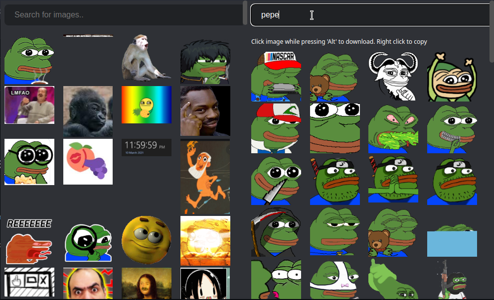

# Handy emoji panel

Cool collection of emojis for discord or any other site

## Installation Instructions Google Chrome / Microsoft Edge

- Download this repo as a ZIP file from GitHub.
- Unzip the file.
- In Chrome/Edge go to the extensions page (chrome://extensions or edge://extensions).
- Enable Developer Mode.
- Drag the extracted folder anywhere on the page to import it (do not delete the folder afterwards).

  
## How to use

#### Already included emojis

Click on the extension. It will open a menu then right click on any emoji and copy it to clipboard

#### Fetch emojis from emoji.gg

Click on the extension. Use the search bar to search any emoji. It will load some emoji (if its available) then right click and copy emoji

  
## Known Issues

- You cant copy animated emojis. save them on your pc and use them.

  
